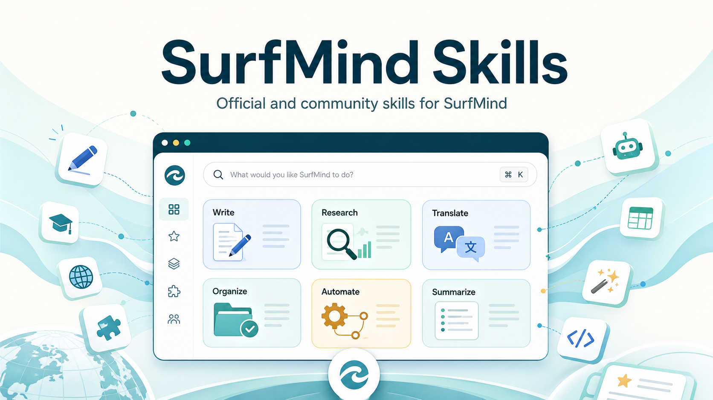

  

<h1 align="center">Awesome SurfMind</h1>

  A curated catalog of skills, MCPs, and community resources for SurfMind, the AI assistant that works where you browse.

  
  
  

  <a href="https://surfmind.ai">Official Site</a>
  ·
  <a href="#-official-surfmind-skills">SurfMind Skills</a>
  ·
  <a href="./awesome-skills.md">Community Skills</a>
  ·
  <a href="#-contributing">Contribute</a>

## 💡 What Is This?

Awesome SurfMind is the public catalog for SurfMind resources. This repo makes useful SurfMind resources easy to discover, review, version, and share. Official resources can live here directly, while community resources can be promoted from their own repos through awesome lists.

- `skills/` contains official SurfMind-maintained skills.
- `awesome-skills.md` lists community skills hosted in external GitHub repos.
- `awesome-mcps.md` lists community MCP servers and integrations (coming soon).
- `CONTRIBUTING.md` explains how to add official skills or list your own.

## 👋 Join The Community

Awesome SurfMind is a shared catalog for useful browser AI workflows. Whether
you use SurfMind every day, maintain your own skill or MCP repo, or just have an
idea that deserves to be reusable, you are welcome here.

| Start here              | What to do                                                                                                                  |
| ----------------------- | --------------------------------------------------------------------------------------------------------------------------- |
| ⭐ Star this repo       | Get release notifications and help more people discover the catalog.                                                        |
| 🧩 Try official skills  | Browse the official skills below and use them in SurfMind.                                                                  |
| 🌊 Share your own skill | Add your GitHub-hosted skill to [`awesome-skills.md`](./awesome-skills.md).                                                 |
| 🔌 Suggest an MCP       | Open an [issue](https://github.com/surfmind-space/surfmind-skills/issues) for an MCP listing or integration idea.           |
| 💬 Suggest an idea      | Open an [issue](https://github.com/surfmind-space/surfmind-skills/issues) for a skill request, bug, or catalog improvement. |

  
  
  

## 🧩 Official SurfMind Skills

<!-- surfmind:official-skills:start -->
| Skill | Categories | Description |
| --- | --- | --- |
| [Answer](./skills/answer/SKILL.md) | Reading & Research, Learning & Tutoring | Answers questions using the selected or visible content as context. |
| [Explain](./skills/explain/SKILL.md) | Reading & Research, Learning & Tutoring | Explains selected or visible content in clear, approachable language. |
| [Fix Grammar](./skills/fix-grammar/SKILL.md) | Writing | Corrects grammar, spelling, punctuation, and wording while preserving meaning. |
| [Improve Writing](./skills/improve-writing/SKILL.md) | Writing | Improves clarity, flow, tone, and polish while preserving intent. |
| [Rewrite Longer](./skills/rewrite-longer/SKILL.md) | Writing | Expands text with more detail, clarity, and flow while preserving meaning. |
| [Rewrite Shorter](./skills/rewrite-shorter/SKILL.md) | Writing | Rewrites text to be shorter and more concise while preserving meaning. |
| [Summarize](./skills/summarize/SKILL.md) | Reading & Research | Creates a concise summary of selected or visible content. |
| [Translate](./skills/translate/SKILL.md) | Languages & Translation | Translates selected or provided text into the chosen language. |
<!-- surfmind:official-skills:end -->

## 🌊 Community Skills

Community skills are maintained by their own authors and listed in
[`awesome-skills.md`](./awesome-skills.md). The list is scan-friendly on GitHub
and machine-validated in CI, so merged entries can be imported into the SurfMind
catalog.

Want to promote your own SurfMind-compatible skill? Host it in a public GitHub
repo, add a collapsed entry to `awesome-skills.md`, regenerate the catalog
tables, choose the most suitable tags, and open a PR.

## 🤝 Contributing

Contributions of all kinds are welcome: new official skills, better prompts,
category fixes, docs polish, bug reports, community skill listings, and soon MCP
listings.

See [`CONTRIBUTING.md`](./CONTRIBUTING.md) for the skill file format, available
metadata fields, community listing format, and local validation commands.

  
  
  

## 📄 License

This repository is licensed under the [MIT License](./LICENSE).
