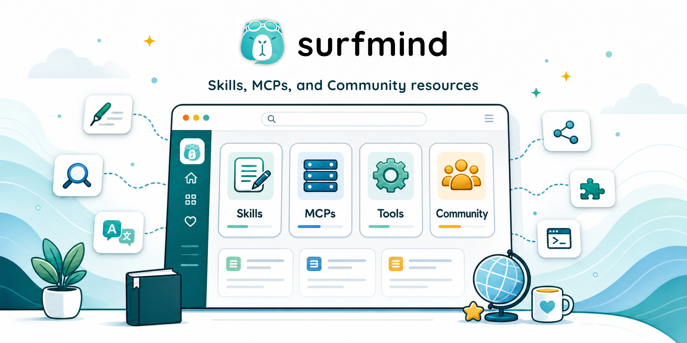

  

<h1 align="center">Awesome SurfMind</h1>

  A curated catalog of skills, MCPs, and community resources for SurfMind, the AI assistant that works where you browse.

  
  
  

  <strong><a href="https://surfmind.ai">Official Site</a></strong>
  &nbsp;·&nbsp;
  <strong><a href="#-official-surfmind-skills">SurfMind Skills</a></strong>
  &nbsp;·&nbsp;
  <strong><a href="./awesome-skills.md">Community Skills</a></strong>
  &nbsp;·&nbsp;
  <strong><a href="#-contributing">Contribute</a></strong>

  
  
  

## 💡 What Is This?

Awesome SurfMind is the public catalog for SurfMind resources. This repo makes useful SurfMind resources easy to discover, review, version, and share. Official resources can live here directly, while community resources can be promoted from their own repos through awesome lists.

- `skills/` contains official SurfMind-maintained skills.
- `awesome-skills.md` lists community skills hosted in external GitHub repos.
- `awesome-mcps.md` lists community MCP servers and integrations (coming soon).
- `CONTRIBUTING.md` explains how to add official skills or list your own.

## 👋 Join The Community

Awesome SurfMind is a shared catalog for useful browser AI workflows. Whether
you use SurfMind every day, maintain your own skill or MCP repo, or just have an
idea that deserves to be reusable, you are welcome here.

| Start here              | What to do                                                                                                                                                         |
| ----------------------- | ------------------------------------------------------------------------------------------------------------------------------------------------------------------ |
| ⭐ Star this repo       | Get release notifications and help more people discover the catalog.                                                                                               |
| 🌊 Try official skills  | Browse the official skills below and use them in SurfMind.                                                                                                         |
| 🤝 Share your own skill | Add an official skill or add your GitHub-hosted skill to [`awesome-skills.md`](./awesome-skills.md). Read [`CONTRIBUTING.md`](./CONTRIBUTING.md) for instructions. |
| 🔌 Suggest an MCP       | Open an [issue](https://github.com/surfmind-space/surfmind-skills/issues) for an MCP listing or integration idea.                                                  |
| 💬 Suggest an idea      | Open an [issue](https://github.com/surfmind-space/surfmind-skills/issues) for a skill request, bug, or catalog improvement.                                        |

  
  

<h2>🌊 Official SurfMind Skills</h2>

<!-- surfmind:official-skills:start -->
| Skill | Categories | Description |
| --- | --- | --- |
| [Answer](./skills/answer/SKILL.md) | Reading & Research, Learning & Tutoring | Answers a question grounded in the selected text or visible page, researching further when the page falls short, always evidence-backed and never invented. |
| [Api To Example](./skills/api-to-example/SKILL.md) | Coding & Development, Learning & Tutoring | Turns REST API documentation into a runnable curl, fetch, or code example with required headers, request body, and placeholders for secrets. |
| [Bilingual Reader](./skills/bilingual-reader/SKILL.md) | Languages & Translation, Learning & Tutoring | Translates selected text and explains the idioms, cultural nuance, key terms, and phrasing that should not be read literally. |
| [Calendar Prep](./skills/calendar-prep/SKILL.md) | Productivity | Turns an event page, calendar invite, email, or notes into key details, an agenda, a preparation checklist, and follow-up reminders. |
| [Caption Assistant](./skills/caption-assistant/SKILL.md) | Social & Content, Writing & Communication | Writes captions, accessibility alt text, and short image or page descriptions tailored to the visible content and audience. |
| [Chart Explainer](./skills/chart-explainer/SKILL.md) | Data & Analytics, Reading & Research | Explains a visible chart by identifying axes, trends, outliers, and the practical takeaway while flagging missing context. |
| [Code Translator](./skills/code-translator/SKILL.md) | Coding & Development, Learning & Tutoring | Converts a code snippet from one programming language to another while preserving behavior and flagging library, runtime, and type-system differences. |
| [Competitor Snapshot](./skills/competitor-snapshot/SKILL.md) | Marketing & Sales, Reading & Research | Summarizes a competitor's page into positioning, audience, offers, pricing cues, proof points, and differentiation opportunities. |
| [Coupon Hunter](./skills/coupon-hunter/SKILL.md) | Shopping & Commerce, Browser & Workflow Automation | Finds legitimate discount codes for the store the user is shopping, points to the sources most likely to carry a working code, and flags suspicious or unverifiable coupon claims. |
| [Course Fit Check](./skills/course-fit-check/SKILL.md) | Career, Learning & Tutoring, Productivity | Evaluates whether a specific course, certification, bootcamp, or training is worth the time and money for the user's stated career goal, weighing recruiter signal, time and opportunity cost, risks, and the artifact it produces. |
| [Cover Letter Builder](./skills/cover-letter-builder/SKILL.md) | Career, Writing & Communication | Builds a tailored cover letter from a job description and the user's background — researches the company, mirrors keywords, handles gaps, and drafts an approval-ready letter. |
| [Deal Checker](./skills/deal-checker/SKILL.md) | Shopping & Commerce, Reading & Research | Judges whether a product's price is worth it by checking typical prices, alternatives, total cost, and timing, then giving a clear buy / wait / skip call. |
| [Draft From Notes](./skills/draft-from-notes/SKILL.md) | Writing & Communication, Productivity | Turns rough notes, bullet points, outlines, or copied fragments into a coherent draft (email, memo, post, report, or document section) while preserving facts and marking gaps instead of inventing detail. |
| [Explain](./skills/explain/SKILL.md) | Reading & Research, Learning & Tutoring | Explains selected or visible content in plain language, including the core idea, jargon, and background, while researching further when the page falls short and staying evidence-backed. |
| [Fact Check](./skills/fact-check/SKILL.md) | Reading & Research | Extracts factual claims from selected text or a page and checks each against the visible context and available sources, flagging what is supported, weakened, contradicted, or still unverified. |
| [Fix Grammar](./skills/fix-grammar/SKILL.md) | Writing & Communication | Corrects grammar, spelling, punctuation, and awkward wording in text while preserving its meaning, tone, and formatting. |
| [Hook Generator](./skills/hook-generator/SKILL.md) | Social & Content, Marketing & Sales, Writing & Communication | Generates strong opening lines for a topic or page using curiosity, contrast, story, and data-driven angles while avoiding unsupported clickbait. |
| [Improve Writing](./skills/improve-writing/SKILL.md) | Writing & Communication | Edits and rewrites prose to improve clarity, flow, tone, and polish while preserving meaning and voice, as a substantive edit beyond grammar fixes. |
| [Interview Prep](./skills/interview-prep/SKILL.md) | Career, Reading & Research, Learning & Tutoring | Prepares for a specific company and role by mapping likely interview rounds, audience-specific questions, proof points, STAR story gaps, and questions to ask back. |
| [Job Application Assistant](./skills/job-application-assistant/SKILL.md) | Career, Writing & Communication, Browser & Workflow Automation | Fills visible job application forms by identifying every field, drafting grounded answers, flagging sensitive questions, and pausing before any submit step. |
| [Job Fit Review](./skills/job-fit-review/SKILL.md) | Career, Reading & Research, Productivity | Reviews a job posting or pasted job description for fit, gaps, legitimacy signals, compensation context, resume customization, and interview prep. |
| [Job Offer Compare](./skills/job-offer-compare/SKILL.md) | Career, Reading & Research, Productivity | Compares two or more job postings, offers, or listings side by side and ranks them on a weighted scorecard covering fit, level, compensation, benefits, growth, remote quality, company signals, and time to offer. |
| [Landing Page Critique](./skills/landing-page-critique/SKILL.md) | Marketing & Sales, Writing & Communication | Reviews a landing page for message clarity, audience fit, proof, calls to action, friction, and conversion improvements. |
| [Linkedin Outreach](./skills/linkedin-outreach/SKILL.md) | Career, Writing & Communication | Drafts short LinkedIn connection or outreach messages for recruiters, hiring managers, peers, and interviewers using the visible job or company context. |
| [Localize Text](./skills/localize-text/SKILL.md) | Languages & Translation, Writing & Communication, Marketing & Sales | Translates and localizes text for a target language, region, and audience — adapts idioms, units, currency, dates, examples, formality, and tone while preserving the original message. |
| [Meeting Follow Up](./skills/meeting-follow-up/SKILL.md) | Writing & Communication, Productivity | Converts meeting notes, minutes, or call transcripts into decisions, action items with owners and deadlines, open questions, and a sendable recap. |
| [Outline Builder](./skills/outline-builder/SKILL.md) | Writing & Communication, Productivity | Turns messy notes, pages, or selected text into a structured outline with headings, key points, evidence, and gaps. |
| [Paper Reader](./skills/paper-reader/SKILL.md) | Reading & Research, Learning & Tutoring | Explains academic papers, abstracts, PDFs, and technical articles by laying out their method, findings, limitations, and implications. |
| [Portfolio Project Review](./skills/portfolio-project-review/SKILL.md) | Career, Productivity, Learning & Tutoring | Evaluates whether a portfolio project, side project, or resume project idea is worth building to land a target role, scoring role signal, uniqueness, demo ability, metrics, time to a working version, and interview-story potential. |
| [Product Review Summarizer](./skills/product-review-summarizer/SKILL.md) | Shopping & Commerce, Reading & Research | Summarizes product reviews into recurring pros, cons, reliability issues, buyer-fit notes, and repeated red flags. |
| [Pronunciation And Usage](./skills/pronunciation-and-usage/SKILL.md) | Languages & Translation, Learning & Tutoring | Explains how to pronounce and naturally use a selected word or phrase, with register, meaning, collocations, and example sentences. |
| [Regex Decoder](./skills/regex-decoder/SKILL.md) | Coding & Development, Learning & Tutoring | Breaks a regular expression down into plain-language parts with examples of what it matches and what it rejects. |
| [Reply Assistant](./skills/reply-assistant/SKILL.md) | Writing & Communication, Productivity | Drafts and refines replies for email, chat, Slack, comments, support tickets, and follow-up messages — adjusting tone and formality, summarizing prior context, and addressing every open question. |
| [Repo Onboarder](./skills/repo-onboarder/SKILL.md) | Coding & Development, Learning & Tutoring | Explains a repository's purpose, structure, setup and run commands, key scripts, and the first files worth opening. |
| [Rewrite Longer](./skills/rewrite-longer/SKILL.md) | Writing & Communication | Expands selected or provided text with more detail, context, and smoother flow while preserving its meaning. |
| [Rewrite Shorter](./skills/rewrite-shorter/SKILL.md) | Writing & Communication | Condenses selected or provided text to be shorter and more concise while keeping its essential meaning and details. |
| [Social Post Generator](./skills/social-post-generator/SKILL.md) | Social & Content, Marketing & Sales, Writing & Communication | Turns a page, article, or product update into platform-ready social posts — Twitter/X threads, LinkedIn posts, and short captions with clear hooks, takeaways, and calls to action. |
| [Source Finder](./skills/source-finder/SKILL.md) | Reading & Research | Finds credible primary or authoritative sources that verify, challenge, or strengthen the claims in selected or visible text, weighing each for authority, recency, and whether it actually supports the claim. |
| [Source List](./skills/source-list/SKILL.md) | Reading & Research | Lists the citations, links, and referenced sources a page relies on and explains what each one appears to support, flagging anything missing, circular, or weakly sourced. |
| [Study Plan](./skills/study-plan/SKILL.md) | Learning & Tutoring, Productivity | Creates a staged learning plan from a topic, course page, or documentation set with goals, practice tasks, and checkpoints. |
| [Style Match](./skills/style-match/SKILL.md) | Writing & Communication | Rewrites, rephrases, and adapts text to match the tone, voice, sentence structure, vocabulary, and formatting of a reference example while preserving meaning and facts. |
| [Summarize](./skills/summarize/SKILL.md) | Reading & Research | Creates a summary that adapts to the source, such as an article, email thread, chat, PDF, document, image, or transcript, while surfacing the key points, decisions, and takeaways. |
| [Table To Csv](./skills/table-to-csv/SKILL.md) | Data & Analytics, Browser & Workflow Automation, Productivity | Converts visible web tables — HTML tables, pricing grids, comparison charts, reports — into clean Markdown tables that users can copy or download as CSV from the extension. |
| [Term Explainer](./skills/term-explainer/SKILL.md) | Reading & Research, Learning & Tutoring | Finds the technical terms, acronyms, and domain phrases on the current page and defines each in plain language, with why it matters in this context. |
| [Terminology Keeper](./skills/terminology-keeper/SKILL.md) | Languages & Translation, Productivity | Builds and applies a consistent glossary for translation — extracting recurring domain terms, suggesting preferred translations, and flagging inconsistencies so terminology stays uniform across a page or document. |
| [Tone Rewriter](./skills/tone-rewriter/SKILL.md) | Writing & Communication | Rewrites selected text to match a requested tone such as professional, friendly, casual, formal, confident, or empathetic, while preserving meaning, facts, and formatting. |
| [Translate](./skills/translate/SKILL.md) | Languages & Translation | Translates selected or provided text into a chosen target language while preserving meaning, tone, and formatting. |
<!-- surfmind:official-skills:end -->

## 🧩 Community Skills

Community skills are maintained by their own authors and listed in
[`awesome-skills.md`](./awesome-skills.md). The list is scan-friendly on GitHub
and machine-validated in CI, so merged entries can be imported into the SurfMind
catalog.

Want to promote your own SurfMind-compatible skill? Host it in a public GitHub
repo, add a collapsed entry to `awesome-skills.md`, choose the most suitable
tags, and open a PR.

## 🤝 Contributing

Contributions of all kinds are welcome: new official skills, better prompts,
category fixes, docs polish, bug reports, community skill listings, and soon MCP
listings.

See [`CONTRIBUTING.md`](./CONTRIBUTING.md) for the skill file format, available
metadata fields, community listing format, and local validation commands.

  
  
  

## 📄 License

This repository is licensed under the [MIT License](./LICENSE).
